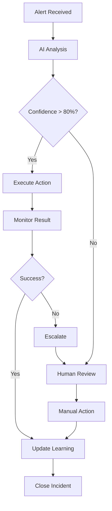

# 🚀 AI On-Call Agent - Production Deployment Guide

## 📋 Overview

The AI On-Call Agent is now **production-ready** with real implementations for all critical incident resolution actions. This guide covers deployment, configuration, and operational procedures.

---

## 🏗️ System Architecture

### Core Components
- **AI Decision Engine**: Pattern recognition and intelligent incident analysis
- **Action Service**: Real-world integrations with infrastructure systems
- **Knowledge Base**: Continuous learning from resolution outcomes
- **API Gateway**: FastAPI-based REST interface
- **Monitoring Dashboard**: Real-time incident tracking

### Supported Platforms
- ✅ **Docker & Docker Swarm**: Container orchestration
- ✅ **Kubernetes**: Pod/deployment management and scaling
- ✅ **Airflow**: DAG task restart and management
- ✅ **Spark**: Application restart and resource scaling
- ✅ **Databases**: PostgreSQL, MySQL, MongoDB connection management
- ✅ **Cache Systems**: Redis, Memcached, filesystem cache clearing
- ✅ **System Services**: systemctl service management

---

## 🔧 Production Installation

### 1. Install Dependencies

```bash
# Clone the repository
git clone <your-repo-url>
cd on-call-agent

# Create virtual environment
python -m venv venv
source venv/bin/activate  # On macOS/Linux
# or: venv\\Scripts\\activate  # On Windows

# Install production dependencies
pip install -r requirements-prod.txt
```

### 2. Environment Configuration

```bash
# Copy and configure environment variables
cp .env.example .env

# Edit configuration
nano .env
```

**Critical Environment Variables:**

```bash
# Database Configuration
DATABASE_HOST=your-db-host.com
DATABASE_PORT=5432
DATABASE_NAME=oncall_agent
DATABASE_USER=oncall_user
DATABASE_PASSWORD=secure_password

# Airflow Integration
AIRFLOW_URL=https://your-airflow.com
AIRFLOW_USERNAME=admin
AIRFLOW_PASSWORD=airflow_password

# Spark Configuration
SPARK_MASTER_URL=spark://spark-master:7077
SPARK_HISTORY_SERVER=http://spark-history:18080

# Kubernetes
KUBECONFIG=/path/to/kubeconfig
KUBERNETES_NAMESPACE=production

# Security
SECRET_KEY=your-256-bit-secret-key
JWT_SECRET_KEY=your-jwt-secret-key
API_KEY=your-api-key

# Monitoring
LOG_LEVEL=INFO
PROMETHEUS_ENABLED=true
METRICS_PORT=9090
```

### 3. Database Setup

```bash
# Initialize database
python scripts/init_database.py

# Verify configuration
python start.py --validate-only
```

### 4. Production Deployment

#### Option A: Docker Deployment

```bash
# Build production image
docker build -t oncall-agent:latest .

# Run with environment file
docker run -d \\
  --name oncall-agent \\
  --env-file .env \\
  -p 8000:8000 \\
  -v /var/run/docker.sock:/var/run/docker.sock \\
  -v ~/.kube:/root/.kube:ro \\
  oncall-agent:latest
```

#### Option B: Kubernetes Deployment

```yaml
# k8s-deployment.yaml
apiVersion: apps/v1
kind: Deployment
metadata:
  name: oncall-agent
spec:
  replicas: 3
  selector:
    matchLabels:
      app: oncall-agent
  template:
    metadata:
      labels:
        app: oncall-agent
    spec:
      containers:
      - name: oncall-agent
        image: oncall-agent:latest
        ports:
        - containerPort: 8000
        envFrom:
        - secretRef:
            name: oncall-agent-secrets
        volumeMounts:
        - name: kubeconfig
          mountPath: /root/.kube
          readOnly: true
      volumes:
      - name: kubeconfig
        secret:
          secretName: kubeconfig
```

```bash
kubectl apply -f k8s-deployment.yaml
```

#### Option C: Systemd Service

```bash
# Create service file
sudo nano /etc/systemd/system/oncall-agent.service
```

```ini
[Unit]
Description=AI On-Call Agent
After=network.target

[Service]
Type=exec
User=oncall
WorkingDirectory=/opt/oncall-agent
Environment=PATH=/opt/oncall-agent/venv/bin
ExecStart=/opt/oncall-agent/venv/bin/python -m uvicorn src.main:app --host 0.0.0.0 --port 8000
Restart=always
RestartSec=10

[Install]
WantedBy=multi-user.target
```

```bash
sudo systemctl enable oncall-agent
sudo systemctl start oncall-agent
```

---

## 🔌 Integration Setup

### 1. Airflow Integration

**Requirements:**
- Airflow 2.7+ with REST API enabled
- Valid authentication credentials
- Network access to Airflow webserver

**Configuration:**
```bash
AIRFLOW_URL=https://your-airflow.example.com
AIRFLOW_USERNAME=admin
AIRFLOW_PASSWORD=your_password
```

**Capabilities:**
- ✅ Restart failed DAG tasks
- ✅ Clear task instances
- ✅ Trigger new DAG runs
- ✅ Reset entire DAG runs

### 2. Kubernetes Integration

**Requirements:**
- Valid kubeconfig file
- RBAC permissions for deployment management
- Network access to Kubernetes API

**Setup:**
```bash
# Copy kubeconfig
cp ~/.kube/config /opt/oncall-agent/kubeconfig

# Set permissions
chmod 600 /opt/oncall-agent/kubeconfig
chown oncall:oncall /opt/oncall-agent/kubeconfig
```

**Capabilities:**
- ✅ Restart deployments
- ✅ Scale replicas
- ✅ Delete and recreate pods
- ✅ Rolling updates

### 3. Docker Integration

**Requirements:**
- Docker daemon access
- Docker Swarm mode (for service scaling)

**Setup:**
```bash
# Add user to docker group
sudo usermod -aG docker oncall

# For Docker socket access in containers
-v /var/run/docker.sock:/var/run/docker.sock
```

**Capabilities:**
- ✅ Restart containers
- ✅ Scale Docker Swarm services
- ✅ Docker Compose service management

### 4. Spark Integration

**Requirements:**
- Spark cluster with REST API enabled
- Network access to Spark master and history server

**Configuration:**
```bash
SPARK_MASTER_URL=spark://spark-master:7077
SPARK_HISTORY_SERVER=http://spark-history:18080
```

**Capabilities:**
- ✅ Kill running applications
- ✅ Submit new jobs with optimized configs
- ✅ Memory and resource scaling

### 5. Database Integration

**Supported Databases:**
- PostgreSQL 12+
- MySQL 8.0+
- MongoDB 4.4+

**Setup Example (PostgreSQL):**
```bash
# Create database and user
sudo -u postgres psql
CREATE DATABASE oncall_agent;
CREATE USER oncall_user WITH PASSWORD 'secure_password';
GRANT ALL PRIVILEGES ON DATABASE oncall_agent TO oncall_user;
```

**Capabilities:**
- ✅ Connection pool restart
- ✅ Connection testing
- ✅ Pool size optimization

---

## 🎯 Production Usage

### 1. API Endpoints

#### Create Incident
```bash
curl -X POST "http://localhost:8000/incidents" \\
  -H "Content-Type: application/json" \\
  -H "X-API-Key: your-api-key" \\
  -d '{
    "title": "Airflow DAG timeout",
    "description": "DAG data_pipeline (dag_id: data_pipeline) failed to complete within 4 hours",
    "service": "airflow",
    "severity": "high",
    "tags": ["dag_timeout", "data_pipeline"]
  }'
```

#### Execute Action
```bash
curl -X POST "http://localhost:8000/actions" \\
  -H "Content-Type: application/json" \\
  -H "X-API-Key: your-api-key" \\
  -d '{
    "action_type": "restart_airflow_dag",
    "parameters": {
      "dag_id": "data_pipeline",
      "dag_run_id": "dag_run_20240730_083000",
      "task_id": "transform_data",
      "reset_dag_run": false
    }
  }'
```

#### Monitor Learning
```bash
curl -X GET "http://localhost:8000/ai/learning-stats" \\
  -H "X-API-Key: your-api-key"
```

### 2. Automated Incident Detection

**Webhook Integration:**
```bash
# Configure your monitoring system to send alerts
curl -X POST "http://localhost:8000/webhooks/alert" \\
  -H "Content-Type: application/json" \\
  -d '{
    "alert_name": "High Memory Usage",
    "severity": "critical",
    "service": "spark",
    "description": "Spark application memory usage above 90%",
    "metadata": {
      "application_id": "app-20240730123456-0001",
      "memory_usage": "92%"
    }
  }'
```

### 3. Real-World Action Examples

#### Restart Kubernetes Deployment
```json
{
  "action_type": "restart_service",
  "parameters": {
    "service_name": "web-app",
    "platform": "kubernetes",
    "namespace": "production"
  }
}
```

#### Scale Application
```json
{
  "action_type": "scale_resources", 
  "parameters": {
    "service_name": "api-service",
    "replicas": 10,
    "platform": "kubernetes",
    "namespace": "production"
  }
}
```

#### Clear Redis Cache
```json
{
  "action_type": "clear_cache",
  "parameters": {
    "cache_type": "redis",
    "host": "redis.example.com",
    "port": 6379,
    "database": 0,
    "pattern": "user_sessions:*"
  }
}
```

#### Restart Database Connections
```json
{
  "action_type": "restart_database_connection",
  "parameters": {
    "database_type": "postgresql",
    "database_name": "production_db",
    "host": "db.example.com",
    "port": 5432,
    "pool_size": 50
  }
}
```

---

## 📊 Monitoring & Observability

### 1. Health Checks

```bash
# System health
curl http://localhost:8000/health

# Component status
curl http://localhost:8000/health/detailed
```

### 2. Metrics

**Prometheus Integration:**
```yaml
# prometheus.yml
scrape_configs:
  - job_name: 'oncall-agent'
    static_configs:
      - targets: ['localhost:9090']
```

**Key Metrics:**
- `incidents_total` - Total incidents processed
- `actions_executed_total` - Actions executed by type
- `resolution_time_seconds` - Time to resolve incidents
- `success_rate` - Action success percentage
- `learning_confidence_score` - AI confidence levels

### 3. Logging

**Structured Logging:**
```json
{
  "timestamp": "2024-07-30T08:15:02.123Z",
  "level": "INFO",
  "logger": "src.services.actions",
  "message": "Restarting Kubernetes deployment",
  "service_name": "web-app",
  "namespace": "production",
  "incident_id": "inc_123456"
}
```

**Log Aggregation:**
- ELK Stack integration
- Splunk compatibility
- CloudWatch/Datadog support

---

## 🔒 Security

### 1. Authentication & Authorization

**API Key Management:**
```bash
# Generate API key
python scripts/generate_api_key.py

# Rotate keys
python scripts/rotate_api_keys.py
```

**JWT Token Authentication:**
```bash
curl -X POST "http://localhost:8000/auth/token" \\
  -H "Content-Type: application/json" \\
  -d '{"username": "admin", "password": "secure_password"}'
```

### 2. Network Security

**Firewall Rules:**
```bash
# Allow only necessary ports
sudo ufw allow 8000/tcp  # API
sudo ufw allow 9090/tcp  # Metrics
sudo ufw enable
```

**TLS Configuration:**
```bash
# Generate certificates
openssl req -x509 -newkey rsa:4096 -nodes \\
  -out cert.pem -keyout key.pem -days 365

# Run with TLS
uvicorn src.main:app \\
  --host 0.0.0.0 \\
  --port 8000 \\
  --ssl-keyfile key.pem \\
  --ssl-certfile cert.pem
```

### 3. Secrets Management

**HashiCorp Vault Integration:**
```python
# vault_config.py
import hvac

client = hvac.Client(url='https://vault.example.com')
client.token = os.getenv('VAULT_TOKEN')

# Retrieve secrets
secrets = client.secrets.kv.v2.read_secret_version(path='oncall-agent')
```

---

## 🚨 Incident Response Workflows

### 1. Automated Response Chain



### 2. Escalation Procedures

**Level 1 - Automated:**
- Confidence > 80%
- Known incident patterns
- Low-risk actions only

**Level 2 - Semi-Automated:**
- Confidence 60-80%
- Requires approval
- Medium-risk actions

**Level 3 - Manual:**
- Confidence < 60%
- Unknown patterns
- High-risk scenarios

### 3. Runbook Integration

**Automated Runbook Execution:**
```json
{
  "incident_type": "database_connection_pool_exhausted",
  "runbook_id": "db_pool_recovery_v2",
  "automated_steps": [
    {
      "step": 1,
      "action": "restart_database_connection",
      "parameters": {"pool_size": 40}
    },
    {
      "step": 2, 
      "action": "clear_cache",
      "parameters": {"pattern": "db_connections:*"}
    },
    {
      "step": 3,
      "action": "scale_resources", 
      "parameters": {"replicas": 8}
    }
  ]
}
```

---

## 📈 Performance Tuning

### 1. Action Execution Optimization

**Parallel Action Execution:**
```python
# config.py
MAX_CONCURRENT_ACTIONS = 10
ACTION_TIMEOUT_SECONDS = 300
RETRY_ATTEMPTS = 3
RETRY_BACKOFF_FACTOR = 2
```

**Resource Limits:**
```bash
# systemd service limits
LimitNOFILE=65536
LimitNPROC=32768
```

### 2. AI Model Optimization

**Training Data Management:**
```bash
# Optimize training data
python scripts/optimize_training_data.py

# Retrain models
python scripts/retrain_models.py --incremental
```

**Performance Monitoring:**
```python
# Monitor response times
ANALYSIS_TIME_THRESHOLD = 2.0  # seconds
LEARNING_UPDATE_INTERVAL = 300  # seconds
```

---

## 🔄 Backup & Recovery

### 1. Data Backup

**Automated Backups:**
```bash
#!/bin/bash
# backup_script.sh

# Backup knowledge base
pg_dump oncall_agent > "backup_$(date +%Y%m%d_%H%M%S).sql"

# Backup learning data
cp data/continuous_learning.json "learning_backup_$(date +%Y%m%d_%H%M%S).json"

# Backup configuration
tar -czf "config_backup_$(date +%Y%m%d_%H%M%S).tar.gz" .env config/
```

### 2. Disaster Recovery

**Recovery Procedures:**
```bash
# 1. Restore database
psql oncall_agent < backup_20240730_120000.sql

# 2. Restore learning data
cp learning_backup_20240730_120000.json data/continuous_learning.json

# 3. Restart services
systemctl restart oncall-agent
```

---

## 📞 Support & Troubleshooting

### Common Issues

**1. Kubernetes Connection Failed**
```bash
# Check kubeconfig
kubectl cluster-info

# Verify permissions
kubectl auth can-i create deployments
```

**2. Airflow API Authentication**
```bash
# Test API access
curl -u admin:password "http://airflow:8080/api/v1/dags"
```

**3. Database Connection Pool**
```bash
# Check pool status
python scripts/check_db_pool.py
```

### Debug Mode

```bash
# Enable debug logging
export LOG_LEVEL=DEBUG

# Run with debug
python -m uvicorn src.main:app --reload --log-level debug
```

### Performance Monitoring

```bash
# Monitor resource usage
htop
iotop
netstat -tulpn

# Check application metrics
curl http://localhost:9090/metrics
```

---

## 🎯 Production Checklist

### Pre-Deployment
- [ ] Environment variables configured
- [ ] Database initialized and accessible
- [ ] All integrations tested (Kubernetes, Airflow, etc.)
- [ ] SSL certificates configured
- [ ] Firewall rules applied
- [ ] Monitoring system connected
- [ ] Backup procedures tested

### Go-Live
- [ ] Health checks passing
- [ ] API endpoints responding
- [ ] Test incident processed successfully
- [ ] Learning system functioning
- [ ] Escalation procedures verified
- [ ] Team training completed

### Post-Deployment
- [ ] Monitor system performance
- [ ] Review incident resolution effectiveness
- [ ] Update runbooks based on learnings
- [ ] Regular backup verification
- [ ] Security audit completed

---

## 📚 Additional Resources

- **API Documentation**: `http://localhost:8000/docs`
- **Monitoring Dashboard**: `http://localhost:8000/dashboard`
- **Metrics Endpoint**: `http://localhost:9090/metrics`
- **Health Check**: `http://localhost:8000/health`

**Support Contacts:**
- Technical Support: support@example.com
- Emergency Escalation: oncall@example.com
- Documentation: docs@example.com

---

**🚀 Your AI On-Call Agent is now production-ready and capable of autonomous incident resolution with continuous learning!**
