# AI On-Call Agent - Complete System Process Flow

## 🏗️ System Architecture Overview

```mermaid
graph TB
    subgraph "External Sources"
        A[Log Files] --> B[Log Poller]
        C[Demo Logs] --> B
        D[Application Logs] --> B
    end
    
    subgraph "Log Monitoring Layer"
        B --> E[Log Monitor Service]
        E --> F[Pattern Matching Engine]
        F --> G{Alert Pattern<br/>Detected?}
    end
    
    subgraph "AI Decision Engine"
        G -->|Yes| H[Create Incident]
        H --> I[Queue for AI Analysis]
        I --> J[AI Decision Loop]
        J --> K[Incident Analysis]
        K --> L[Knowledge Base Query]
        L --> M[Confidence Calculation]
        M --> N{Confidence ≥ 0.60?}
    end
    
    subgraph "Action Execution Layer"
        N -->|Yes| O[Automated Resolution]
        O --> P[Execute Actions]
        P --> Q[Action Results]
        Q --> R{All Actions<br/>Successful?}
        
        N -->|No| S[Manual Intervention Alert]
    end
    
    subgraph "Resolution Outcomes"
        R -->|Yes| T[✅ Full Success]
        R -->|Partial| U[⚠️ Partial Success]
        R -->|No| V[❌ Failed - Escalate]
        
        T --> W[Incident Resolved]
        U --> X[Manual Review Required]
        V --> Y[Human Intervention]
        S --> Y
    end
    
    subgraph "Feedback Loop"
        W --> Z[Update Knowledge Base]
        X --> Z
        Y --> Z
        Z --> L
    end
```

## 🔄 Detailed Process Flow

### Phase 1: Log Ingestion & Pattern Detection

### Phase 2: AI Analysis & Decision Making

```mermaid
sequenceDiagram
    participant LM as Log Monitor
    participant AIQ as AI Queue
    participant AI as AI Decision Engine
    participant KB as Knowledge Base
    participant ML as ML Models
    
    LM->>AIQ: 📥 Queue incident
    AIQ->>AI: 🔥 Process incident
    
    AI->>AI: 🚀 Start processing
    AI->>ML: 🔬 Analyze incident
    
    ML->>KB: Query similar incidents
    KB->>ML: Return matching solutions
    
    ML->>AI: Calculate confidence score
    
    alt Confidence ≥ 0.60
        AI->>AI: 🤖 Trigger automation
    else Confidence < 0.60
        AI->>AI: ⚠️ Require manual intervention
    end
```

### Phase 3: Action Execution & Results

```mermaid
flowchart TD
    A[🤖 Automated Resolution Triggered] --> B[🔧 Execute Actions]
    
    B --> C{Action Type}
    
    C -->|restart_service| D[📋 Restart Service]
    C -->|scale_resources| E[📋 Scale Resources]
    C -->|restart_database_connection| F[📋 Restart DB Connection]
    C -->|call_api_endpoint| G[📋 API Call]
    
    D --> H{Success?}
    E --> I{Success?}
    F --> J{Success?}
    G --> K{Success?}
    
    H -->|✅| L[Action 1 Complete]
    H -->|❌| M[Action 1 Failed]
    
    I -->|✅| N[Action 2 Complete]
    I -->|❌| O[Action 2 Failed]
    
    J -->|✅| P[Action 3 Complete]
    J -->|❌| Q[Action 3 Failed]
    
    K -->|✅| R[Action 4 Complete]
    K -->|❌| S[Action 4 Failed]
    
    L --> T[Calculate Final Result]
    M --> T
    N --> T
    O --> T
    P --> T
    Q --> T
    R --> T
    S --> T
    
    T --> U{All Actions Successful?}
    
    U -->|Yes| V[🎉 Full Success]
    U -->|Some Failed| W[⚠️ Partial Success]
    U -->|All Failed| X[❌ Complete Failure]
    
    V --> Y[✅ Incident Resolved]
    W --> Z[Manual Review Required]
    X --> AA[🚨 Escalate to Human]
```

## 📊 Real Example Workflows

### Example 1: Database Connection Error - Full Success

```mermaid
graph LR
    A[Log Entry:<br/>Connection timeout] --> B[Pattern Match:<br/>Database Error]
    B --> C[AI Analysis:<br/>Confidence 0.83]
    C --> D[Action 1:<br/>Restart DB Connection ✅]
    D --> E[Action 2:<br/>Restart Service ✅]
    E --> F[Result:<br/>🎉 Full Success]
```

### Example 2: Out of Memory Error - Partial Success

```mermaid
graph LR
    A[Log Entry:<br/>OutOfMemoryError] --> B[Pattern Match:<br/>OOM Error]
    B --> C[AI Analysis:<br/>Confidence 0.81]
    C --> D[Action 1:<br/>Restart Service ❌]
    D --> E[Action 2:<br/>Scale Resources ✅]
    E --> F[Result:<br/>⚠️ Partial Success<br/>Manual Review]
```

### Example 3: Airflow Task Failure - Manual Intervention

```mermaid
graph LR
    A[Log Entry:<br/>Task failed] --> B[Pattern Match:<br/>Airflow Failure]
    B --> C[AI Analysis:<br/>Confidence 0.38]
    C --> D[Below Threshold:<br/>0.38 < 0.60]
    D --> E[Result:<br/>🚨 Manual Intervention]
```

## 🎯 Key Decision Points

### Confidence Threshold Logic

```mermaid
flowchart TD
    A[Calculate Confidence Score] --> B{Score Components}
    
    B --> C[Knowledge Base Matches<br/>+0.4 per match]
    B --> D[Severity Weight<br/>High: +0.3, Critical: +0.5]
    B --> E[Pattern Specificity<br/>+0.1 to +0.3]
    B --> F[Service Recognition<br/>+0.1 if known]
    
    C --> G[Final Score]
    D --> G
    E --> G
    F --> G
    
    G --> H{Score ≥ 0.60?}
    
    H -->|Yes| I[🤖 Automate]
    H -->|No| J[👨‍💻 Manual]
    
    I --> K[Execute Actions]
    J --> L[Create Alert]
```

## 🔧 Action Types & Parameters

| Action Type | Parameters | Success Criteria | Failure Handling |
|-------------|------------|------------------|-------------------|
| `restart_service` | `service_name` | Service responds to health check | Log error, continue to next action |
| `scale_resources` | `service_name`, `replicas` | Resource allocation confirmed | Revert if possible |
| `restart_database_connection` | `database_name` | Connection pool refreshed | Escalate immediately |
| `call_api_endpoint` | `url`, `method`, `data` | HTTP 2xx response | Retry once, then fail |

## 📈 System Health Monitoring

## 🚀 System Startup Sequence

```mermaid
sequenceDiagram
    participant Main as Main Application
    participant DB as Database
    participant LM as Log Monitor
    participant AI as AI Engine
    participant AE as Action Engine
    participant LP as Log Poller
    
    Main->>DB: Initialize database
    Main->>AI: Start AI decision engine
    Main->>LM: Start log monitoring
    Main->>AE: Start action engine
    Main->>LP: Start log polling
    
    Note over AI: 🚀 Decision loop begins<br/>Polling queue every 2s
    
    Note over LP: 📁 Monitor log sources:<br/>- application_logs<br/>- demo_logs
    
    Note over Main: ✅ System ready for incidents
```

## 🔄 Continuous Learning Loop

## 📝 Summary

The AI On-Call Agent system provides:

1. **Real-time Log Monitoring** - Continuous scanning of log sources
2. **Intelligent Pattern Recognition** - AI-powered incident detection
3. **Automated Decision Making** - Confidence-based automation triggers
4. **Multi-Action Execution** - Parallel and sequential action handling
5. **Comprehensive Logging** - Full visibility into resolution process
6. **Escalation Management** - Seamless handoff to human operators
7. **Continuous Learning** - Self-improving through feedback loops

**Key Success Metrics:**
- 🎯 **Automation Rate**: 60%+ of incidents handled automatically
- ⚡ **Response Time**: < 2 minutes from detection to action
- 🎉 **Success Rate**: 85%+ of automated actions succeed
- 📊 **Confidence Accuracy**: 90%+ correlation between confidence and success
